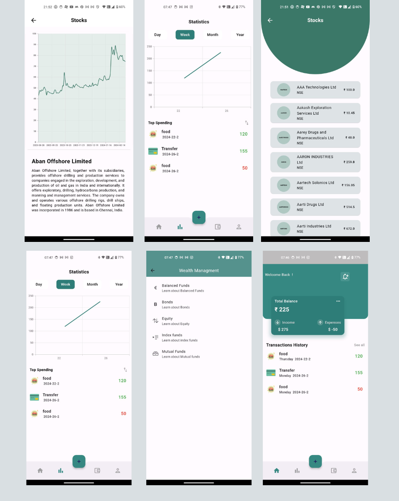

# Finspire

## Description

"Finspire" is a versatile finance app designed in Flutter, providing users with a comprehensive set of features to manage their finances efficiently. It includes a "Finance Tracker" to monitor daily financial activities, a "Stock List" to explore stocks of Indian companies listed on the National Stock Exchange (NSE), and a "Literacy Section" offering valuable insights into various financial topics.
Foobar is a flutter application that can help you learn about finance, track your finance and read about various stocks on the indian stock market

## Features

* **Finance Tracker**: 
  - Add daily transactions (income or expense) with a description and amount.
  - View daily, weekly, or monthly transaction summary in a graph.
* **Stock List**:
  - Browse a list of Indian company stocks listed on the NSE.
  - Click on a stock to view detailed information about it.
* **Literacy Section**:
  - Read articles and information about finance, investments, and personal finance management.

## Installation

In order to use this application: 
    1: Clone this repository
    2: Run 'flutter pub get'
    3: Pick the device you want to run it on(optimized for android and ios) and run : 'flutter run

## Project Status

This project is still in development and will be updated with feature additions over time
A primairy addition for that is planned is migration to firebase and away from local storage

